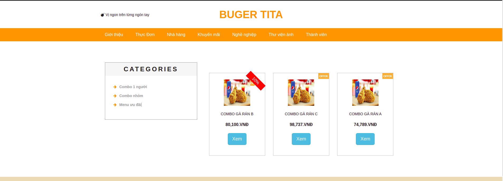
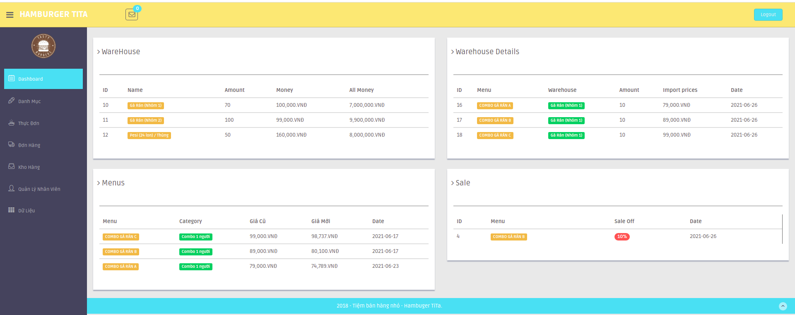

<p align="center"><a href="https://laravel.com" target="_blank"></a></p>

# Fast food management

## Laravel 7.x

### Quick Start

 - Install the package through [Composer](https://getcomposer.org/).
 - Clone this repository and install the dependencies.

````
    git clone https://github.com/thienhv-dev/fast_food.git
    cd src/
    composer install && composer update
````
   - Run the command below to initialize. Do not forget to configure your .env file.
````
    cp .env.example => .env
````
   - Add composer.json
````
    "autoload": {
        "files": [
        "app/Helpers/function.php"
        ]  

    composer dump-autoload
````
   - Run Sql (Sql - trigger)
````
    php artisan migrate
    or
    import file sql/*.sql
````
   - Finally, serve the application.
````
    php artisan serve
````
   - Open http://localhost:8000/Hambuger from your browser. 
   - To access the admin panel, hit the link http://localhost:8000/Admin
   
### Screenshots




   


